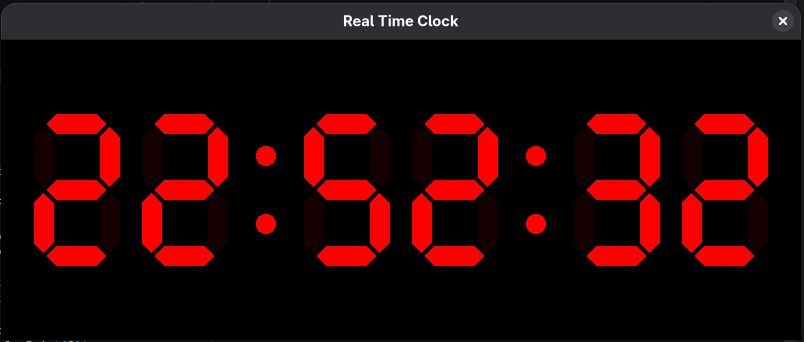

# Digital Clock

Relógio em tempo real renderizado com Ebiten (Go). Dígitos formados por losangos (estilo display segmentado).



## O que utiliza

- [Go](https://go.dev/) 1.25+
- [Ebiten v2](https://github.com/hajimehoshi/ebiten) — game engine 2D
- `image/color` — cores RGBA
- `ebiten/vector` — desenho vetorial (paths, fills)

## Como funciona

- `main.go` define struct `ScreenState` com 3 métodos exigidos pelo Ebiten:
  - `Update()` — atualiza blueprint do horário atual por frame
  - `Draw(screen)` — chama `DrawClock` por frame
  - `Layout()` — resolução interna
- `draw.go` desenha o relógio: 6 dígitos (HH:MM:SS) montados por 7 losangos cada (segmentos), mais 4 pontos separadores. Cada losango usa `vector.Path` preenchido via `vector.FillPath`.
- Blueprint `[6][7]bool` indica quais segmentos de cada dígito estão ligados.
- `main()` configura janela e roda loop com `ebiten.RunGame`.

## Propriedades para mudar

### `main.go`

| Constante | Função | Default |
|---|---|---|
| `WIN_W` | largura da janela | `800` |
| `WIN_H` | altura da janela | `300` |
| `WIN_TITLE` | título da janela | `"Digital Clock"` |

### `draw.go`

| Constante | Função | Default |
|---|---|---|
| `DIAMOND_SIZE` | tamanho base de cada losango (segmento) | `10` |
| `DIAMOND_OFFSET` | espaço entre losangos no mesmo dígito | `3` |
| `DIGIT_OFFSET` | offset vertical dos pontos separadores | `34` |
| `DOT_SIZE` | raio dos pontos separadores `:` | `10` |
| `DIAMOND_CLR_ON` | cor de segmento ligado | `RGBA{255,0,0,255}` |
| `DIAMOND_CLR_OFF` | cor de segmento desligado | `RGBA{20,0,0,255}` |

## Como instalar

```bash
git clone <repo>
cd side-projects
go mod download
go run .
```

Build binário:

```bash
go build -o clock .
./clock
```
